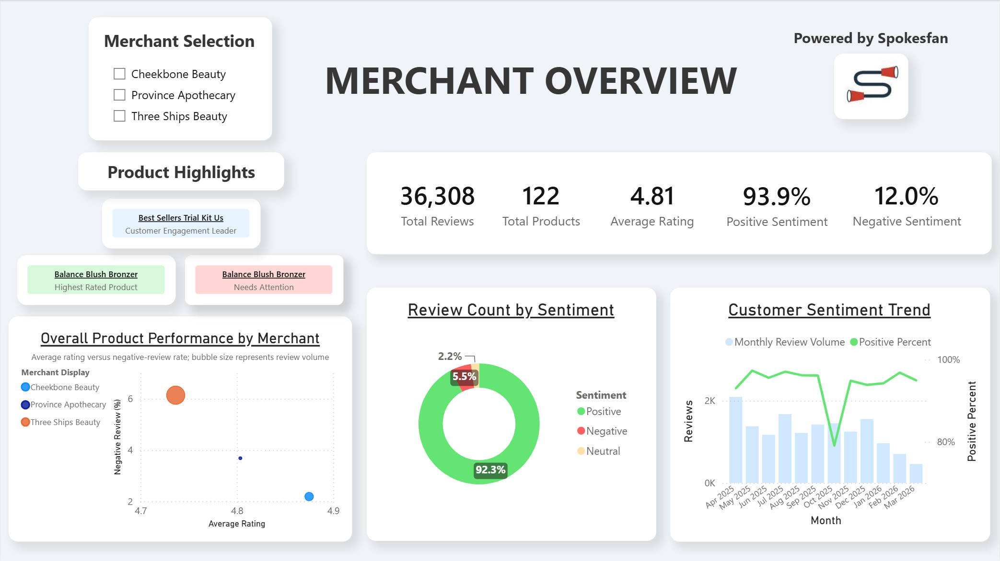
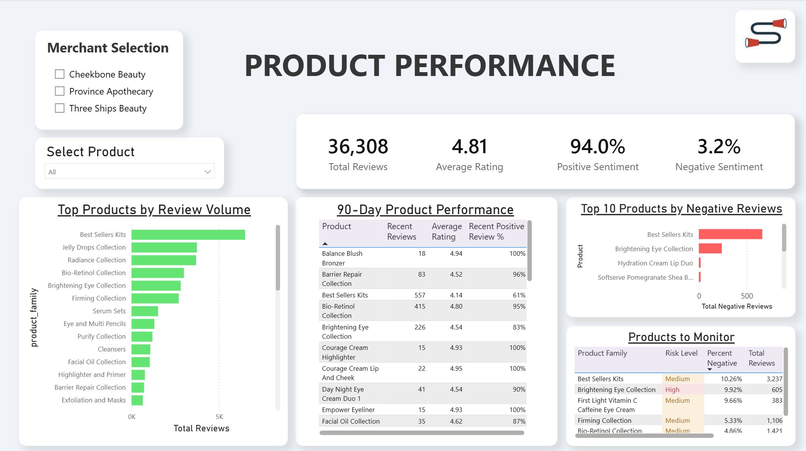
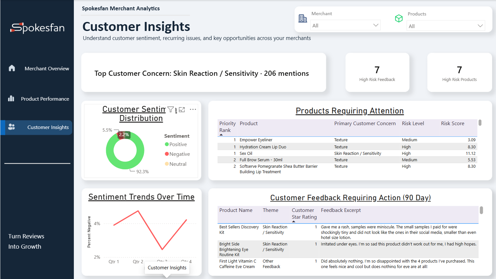

# Spokesfan Merchant Analytics

Merchant-facing analytics project for evaluating product performance, customer sentiment, recurring concerns, and product risk in Power BI.

## Project structure

```text
SpokesfanMerchantAnalytics/
├── dashboard/                  # Power BI project and dashboard previews
├── documentation/
│   ├── PROJECT_DECISIONS.md    # Design, methodology, and decision rationale
│   └── PIPELINE_OUTPUTS.md     # Generated dashboard tables and their purposes
├── scripts/                    # Dashboard data pipeline
├── src/                        # Shared review-classification and path logic
└── requirements.txt            # Python runtime dependencies
```

Source and processed datasets are maintained locally and excluded from the public repository.

The local project also uses:

```text
data/
├── raw/                        # Original merchant product and review exports
└── processed/                  # Sentiment-scored reviews and Power BI input tables
```

The public repository contains the transformation code, project documentation, Power BI project structure, and dashboard previews used to demonstrate the analytics workflow.

## Setup

Create and activate a virtual environment, then install the dependencies:

```powershell
py -m venv .venv
.\.venv\Scripts\Activate.ps1
pip install -r requirements.txt
```

## Build the dashboard data

With the required local source and processed datasets available, run the dashboard pipeline with:

```powershell
python scripts\run_dashboard_pipeline.py
```

To rerun sentiment scoring from the raw merchant review exports first:

```powershell
python scripts\run_dashboard_pipeline.py --score-reviews
```

The optional scoring step uses `cardiffnlp/twitter-roberta-base-sentiment-latest` and takes longer than the downstream metric build.

## Pipeline order

The runner executes the dashboard transformations in dependency order:

1. `build_core_metrics.py`
2. `build_theme_metrics.py`
3. `build_product_risk_analysis.py`
4. `build_review_quality.py`
5. `build_merchant_summary.py`
6. `build_product_catalog.py`
7. `build_sentiment_distribution.py`
8. `enrich_theme_metrics.py`
9. `build_customer_voice.py`
10. `build_product_risk_summary.py`

`score_reviews_roberta.py` is optional when a locally generated `data/processed/reviews_with_roberta_sentiment.csv` file already exists.

## Power BI report

Open the Power BI Project from:

```text
dashboard\MerchantDashboard\Spokesfan_Merchant_Analytics.pbip
```

The report contains three primary pages:

1. **Merchant Overview**
2. **Product Performance**
3. **Customer Insights**

If the project folder is moved, update the CSV source paths in Power Query before refreshing the report.

Refreshing the report requires the corresponding local processed datasets.

## Documentation

- [`documentation/PROJECT_DECISIONS.md`](documentation/PROJECT_DECISIONS.md) explains the major data, modeling, metric, and dashboard decisions and why they were made.
- [`documentation/PIPELINE_OUTPUTS.md`](documentation/PIPELINE_OUTPUTS.md) lists the generated dashboard tables and their purposes.

## Dashboard previews

### Merchant Overview



### Product Performance



### Customer Insights


